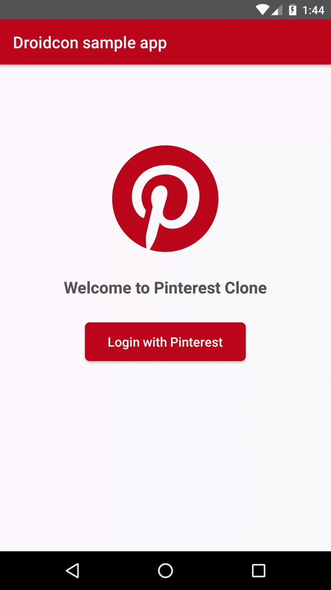

Droidcon Demo App
=======

The demo app looks like this:

It will go over the 4 problems we will talk about in the slides. 

In order to check out the initial "bad" code do: 

`git checkout bad_code`

In order to check out the solution to problem 1-4: 

`git checkout problem<X>_solution`

eg. `git checkout problem1_solution`

In order to checkout the final solution code do:
`git checkout final_solution`

====
*Note:* this app will not run without Pinterest PDK api key. 

Getting an API key should be fairly straight forward . 

First, create a Pinterest Developer application.

Once you have created your first Pinterest developer account, you can copy the API key from the developer application. Paste it into the `strings.xml` file.

